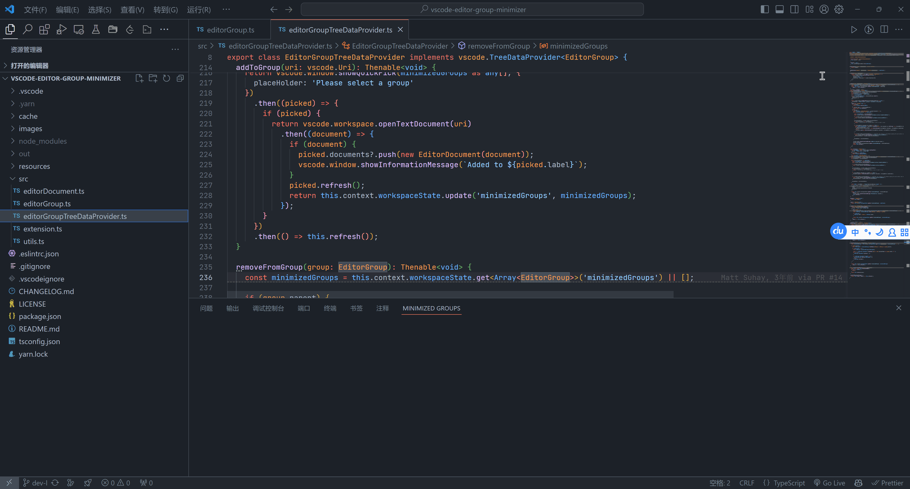

# Editor Group Minimizer2 for VSCode

fork from `https://github.com/suhay/vscode-editor-group-minimizer`

--------

- 增加了添加到已有group
- 增加了文件图标显示
- 增加对文件点击打开
- 增加默认需要命名
- 增加将当前标签页与保存的group进行替换
-------

# origin Readme

How many times have you been working on a feature with 20 different editor tabs open only to be derailed to work on a one off task or bug fix? You now have to decide:

1. Shove all your current tabs into a split editor, sacrificing window real estate because that split can never be fully minimized?
2. Try keeping your previous work separate from your current using a `README` as an ineffective boarder guard?
3. Start closing tabs out while telling yourself, "I'll remember where I was, this is fine!"

## Features

Quickly save a list of all open Editor tabs and place them into an easily managed view. From there, you can see a preview of the files, restore them back into tabs, rename the group for better organization, or remove the reference list from the view.

> Note: This does not save or edit the files within the list. It only saves, restores, and removes the references from the view. The files will remain untouched.

new group:

add one document to a existing group:

add all document to a existing group:

swap all document save to a group, and restore selected group:

## Known Issues

 - VSCode doesn't support direct tab access via the API so options of what we can do is limited.
